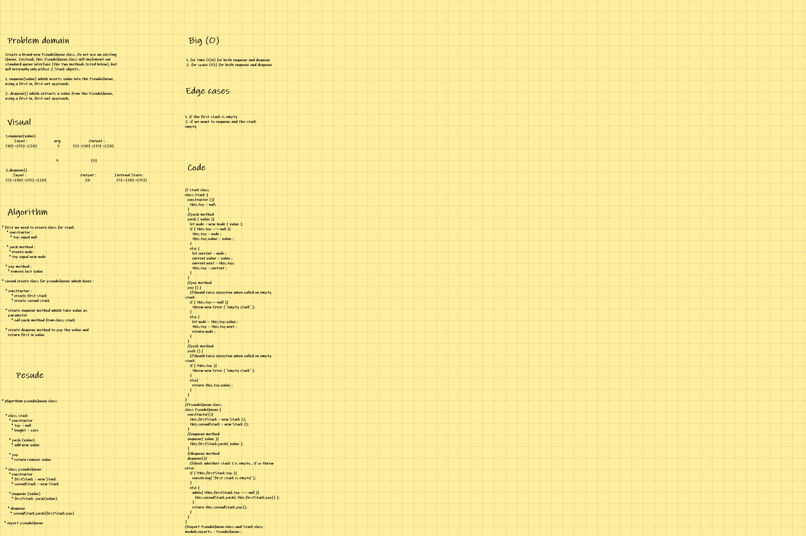

## CODE CHALLENGE 11 : QUEUE WITH STACKS

### *Create a brand new PseudoQueue class. Do not use an existing Queue. Instead, this PseudoQueue class will implement our standard queue interface (the two methods listed below), but will internally only utilize 2 Stack objects*

[QUEUE WITH STACKS Code](https://github.com/farahalwahaibi/data-structures-and-algorithms-401/blob/main/code-challenge11/queue-with-stacks.js)

[QUEUE WITH STACKS Test](https://github.com/farahalwahaibi/data-structures-and-algorithms-401/blob/main/code-challenge11/__test__/queue-with-stacks.test.js)

### **White Board for queue with stack**

[QUEUE WITH STACKS Test](https://github.com/farahalwahaibi/data-structures-and-algorithms-401/blob/main/code-challenge11/__test__/queue-with-stacks.test.js)
