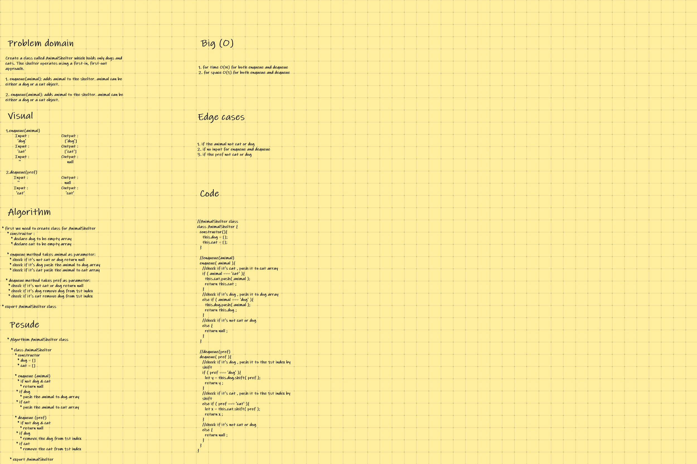
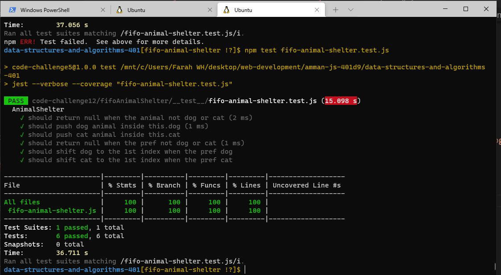

## CODE CHALLENGE 12 : fifo-animal-shelter

### *Create a class called AnimalShelter which holds only dogs and cats. The shelter operates using a first-in, first-out approach.*
**Implement the following methods:**

* enqueue(animal): adds animal to the shelter. animal can be either a dog or a cat object.
* dequeue(pref): returns either a dog or a cat. If pref is not "dog" or "cat" then return null.

[fifo-animal-shelter Code](https://github.com/farahalwahaibi/data-structures-and-algorithms-401/blob/main/code-challenge12/fifoAnimalShelter/fifo-animal-shelter.js)

[fifo-animal-shelter Test](https://github.com/farahalwahaibi/data-structures-and-algorithms-401/blob/main/code-challenge12/fifoAnimalShelter/__test__/fifo-animal-shelter.test.js)

### **White Board for Fifo-Animal-Shelter**

