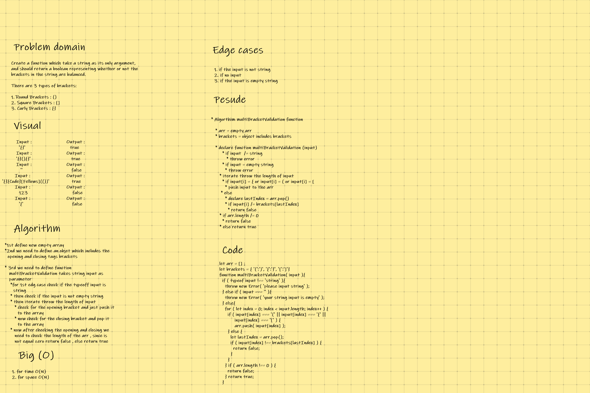

## CODE CHALLENGE 13 : multi-bracket-validation

### Create a function which take a string as its only argument, and should return a boolean representing whether or not the brackets in the string are balanced.

**There are 3 types of brackets:**

* Round Brackets : ()
* Square Brackets : []
* Curly Brackets : {}

[multi-bracket-validation Code](https://github.com/farahalwahaibi/data-structures-and-algorithms-401/blob/main/code-challenge13/multiBracketValidation/multi-bracket-validation.js)

[multi-bracket-validation Test](https://github.com/farahalwahaibi/data-structures-and-algorithms-401/blob/main/code-challenge13/multiBracketValidation/__test__/multi-bracket-validation.test.js)

### **White Board for multi-bracket-validation**

### **Test**

[multi-bracket-validation Test](https://github.com/farahalwahaibi/data-structures-and-algorithms-401/blob/main/code-challenge13/multiBracketValidation/__test__/multi-bracket-validation.test.js)

