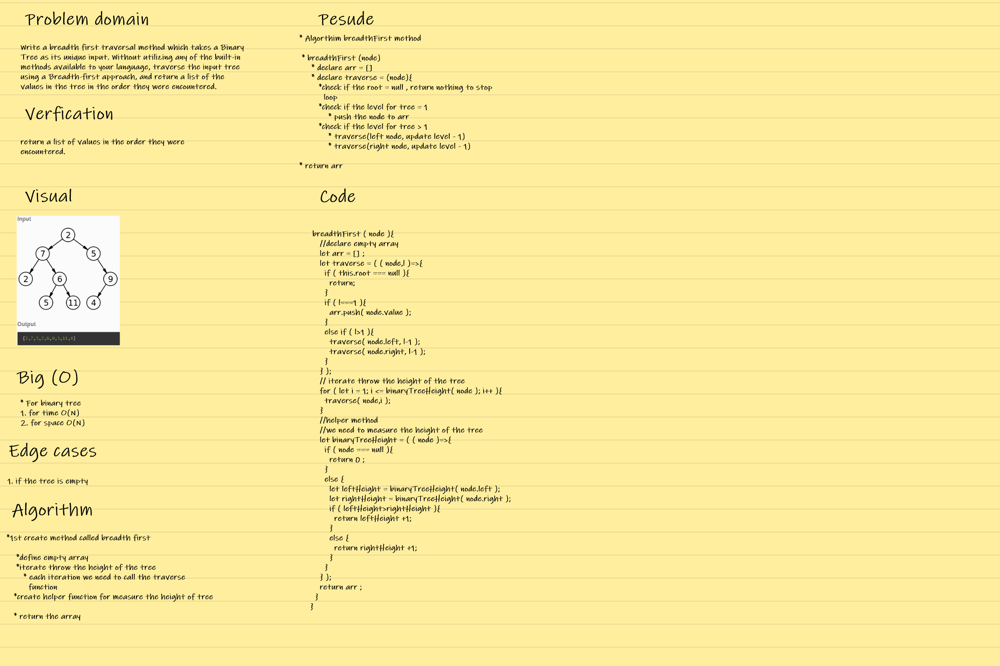

## **CODE CHALLENGE 15 : Trees /breadth-first**

### Write a breadth first traversal method which takes a Binary Tree as its unique input. Without utilizing any of the built-in methods available to your language, traverse the input tree using a Breadth-first approach, and return a list of the values in the tree in the order they were encountered.

[Trees/breadth-first Code](https://github.com/farahalwahaibi/data-structures-and-algorithms-401/blob/main/code-challenge14/tree/tree.js)

[Trees/breadth-first Test](https://github.com/farahalwahaibi/data-structures-and-algorithms-401/blob/main/code-challenge14/tree/__test__/tree.test.js)

### **White Board for Trees /breadth-first**

### **Test**

[Trees/breadth-first Test](https://github.com/farahalwahaibi/data-structures-and-algorithms-401/blob/main/code-challenge14/tree/__test__/tree.test.js)

