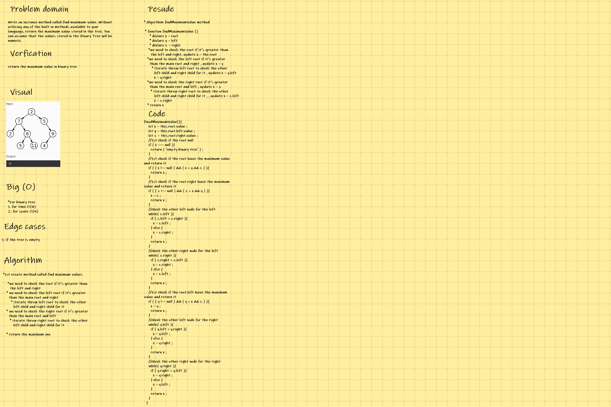

## **CODE CHALLENGE 15 : Trees /find-maximum-value**

### Write an instance method called find-maximum-value. Without utilizing any of the built-in methods available to your language, return the maximum value stored in the tree. You can assume that the values stored in the Binary Tree will be numeric.

[Trees/find-maximum-value Code](https://github.com/farahalwahaibi/data-structures-and-algorithms-401/blob/main/code-challenge14/tree/tree.js)

[Trees/find-maximum-value Test](https://github.com/farahalwahaibi/data-structures-and-algorithms-401/blob/main/code-challenge14/tree/__test__/tree.test.js)

### **White Board for multi-bracket-validation**

### **Test**

[Trees/find-maximum-value Test](https://github.com/farahalwahaibi/data-structures-and-algorithms-401/blob/main/code-challenge14/tree/__test__/tree.test.js)

