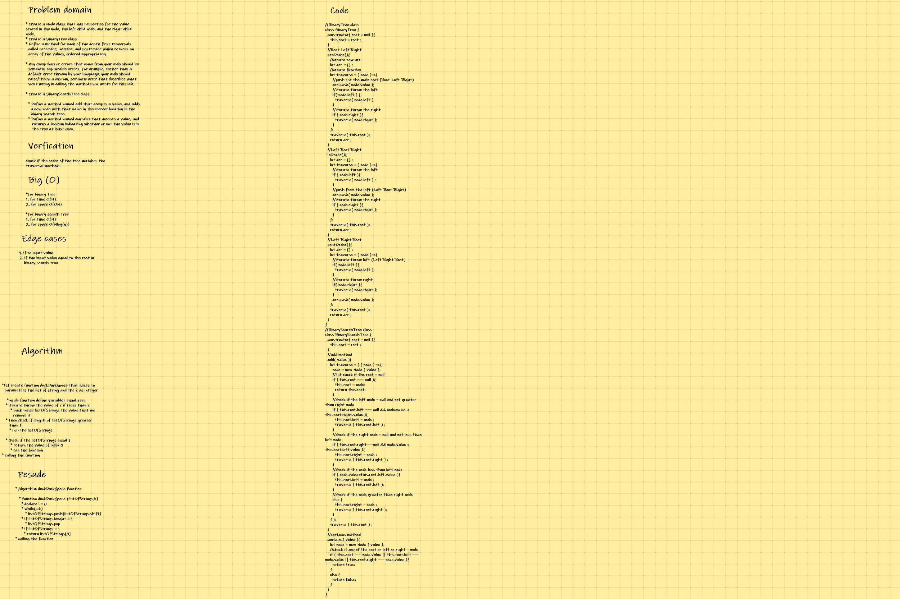
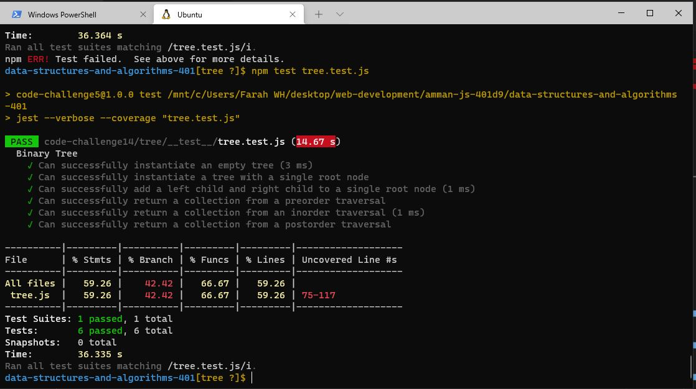

## **CODE CHALLENGE 14 : Trees**

### A tree is a nonlinear data structure, compared to arrays, linked lists, stacks and queues which are linear data structures. A tree can be empty with no nodes or a tree is a structure consisting of one node called the root and zero or one or more subtrees.

* Binary Tree 
* Binary Search Tree

[Trees Code](https://github.com/farahalwahaibi/data-structures-and-algorithms-401/blob/main/code-challenge14/tree/tree.js)

[Trees Test](https://github.com/farahalwahaibi/data-structures-and-algorithms-401/blob/main/code-challenge14/tree/__test__/tree.test.js)

### **White Board for multi-bracket-validation**

### **Test**

[Trees Test](https://github.com/farahalwahaibi/data-structures-and-algorithms-401/blob/main/code-challenge14/tree/__test__/tree.test.js)

