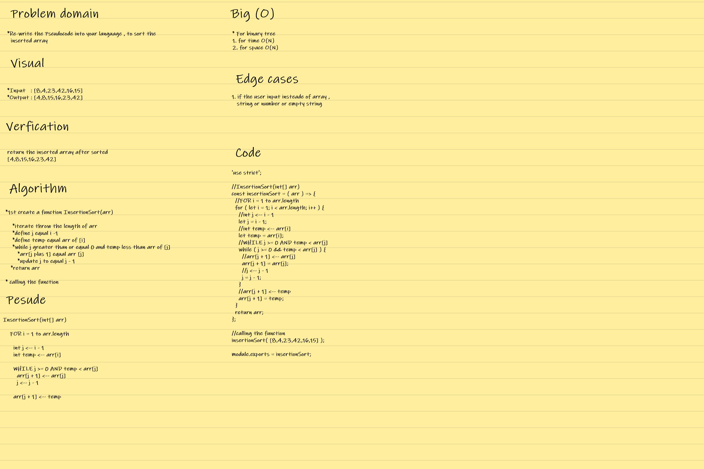
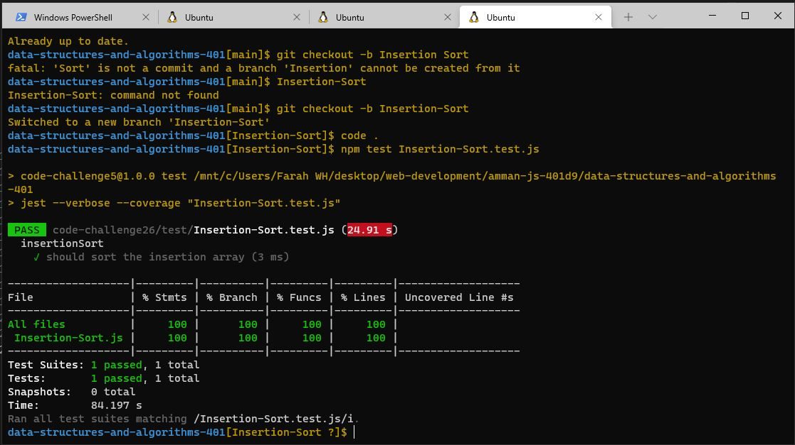

## **CODE CHALLENGE 26 : Insertion Sort**

Review the pseudocode below, then trace the algorithm by stepping through the process with the provided sample array. Document your explanation by creating a blog article that shows the step-by-step output after each iteration through some sort of visual.

### **Pseudocode :**

      InsertionSort(int[] arr)
  
    FOR i = 1 to arr.length
    
      int j <-- i - 1
      int temp <-- arr[i]
      
      WHILE j >= 0 AND temp < arr[j]
        arr[j + 1] <-- arr[j]
        j <-- j - 1
        
      arr[j + 1] <-- temp

[Insertion-Sort Code](https://github.com/farahalwahaibi/data-structures-and-algorithms-401/blob/main/code-challenge26/Insertion-Sort.js)

[Insertion-Sort Test](https://github.com/farahalwahaibi/data-structures-and-algorithms-401/blob/main/code-challenge26/__test__/Insertion-Sort.test.js)

### **White Board for Insertion Sort**

### **BLOG**
[BLOG file](https://github.com/farahalwahaibi/data-structures-and-algorithms-401/blob/main/code-challenge26/BLOG.md)

### **Test**

[Insertion-Sort Test](https://github.com/farahalwahaibi/data-structures-and-algorithms-401/blob/main/code-challenge26/__test__/Insertion-Sort.test.js)

