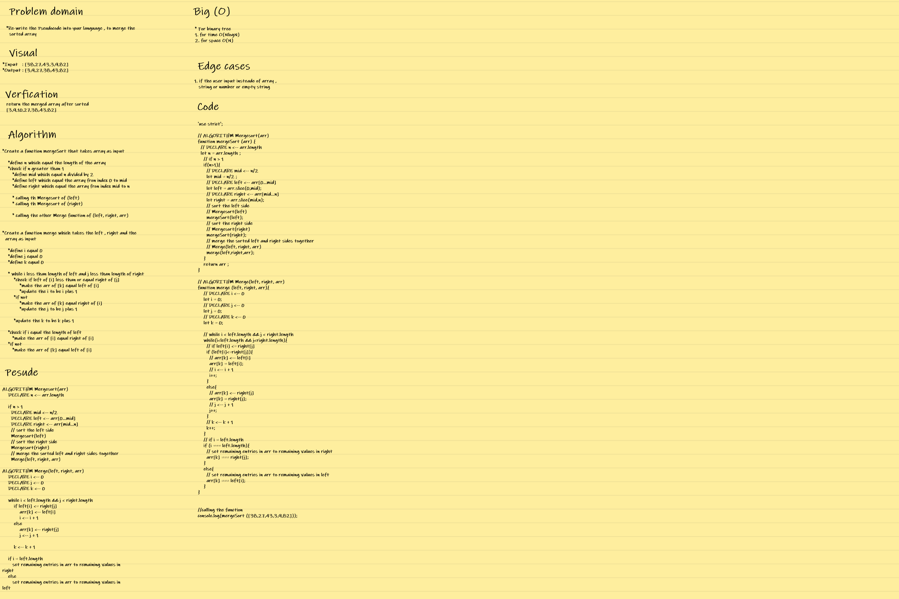
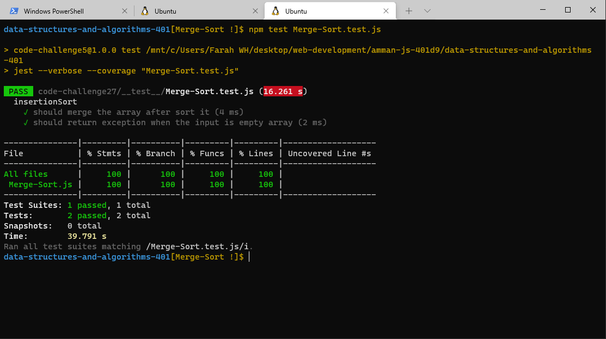

## **CODE CHALLENGE 27 : Merge Sort**

Selection Sort is a sorting algorithm that traverses the array multiple times as it slowly builds out the sorting sequence. The traversal keeps track of the minimum value and places it in the front of the array which should be incrementally sorted.

### **Pseudocode :**

    ALGORITHM Mergesort(arr)
    DECLARE n <-- arr.length
           
    if n > 1
      DECLARE mid <-- n/2
      DECLARE left <-- arr[0...mid]
      DECLARE right <-- arr[mid...n]
      // sort the left side
      Mergesort(left)
      // sort the right side
      Mergesort(right)
      // merge the sorted left and right sides together
      Merge(left, right, arr)

    ALGORITHM Merge(left, right, arr)
    DECLARE i <-- 0
    DECLARE j <-- 0
    DECLARE k <-- 0

    while i < left.length && j < right.length
        if left[i] <= right[j]
            arr[k] <-- left[i]
            i <-- i + 1
        else
            arr[k] <-- right[j]
            j <-- j + 1
            
        k <-- k + 1

    if i = left.length
       set remaining entries in arr to remaining values in right
    else
       set remaining entries in arr to remaining values in left

[Merge-Sort Code](https://github.com/farahalwahaibi/data-structures-and-algorithms-401/blob/main/code-challenge27/Merge-Sort.js)

[Merge-Sort Test](https://github.com/farahalwahaibi/data-structures-and-algorithms-401/blob/main/code-challenge27/__test__/Merge-Sort.test.js)

### **White Board for Insertion Sort**

### **BLOG**
[BLOG file](https://github.com/farahalwahaibi/data-structures-and-algorithms-401/blob/main/code-challenge27/BLOG.md)

### **Test**

[Merge-Sort Test](https://github.com/farahalwahaibi/data-structures-and-algorithms-401/blob/main/code-challenge27/__test__/Merge-Sort.test.js)

