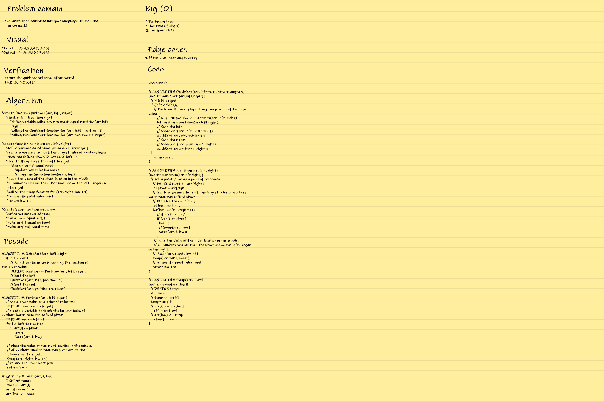
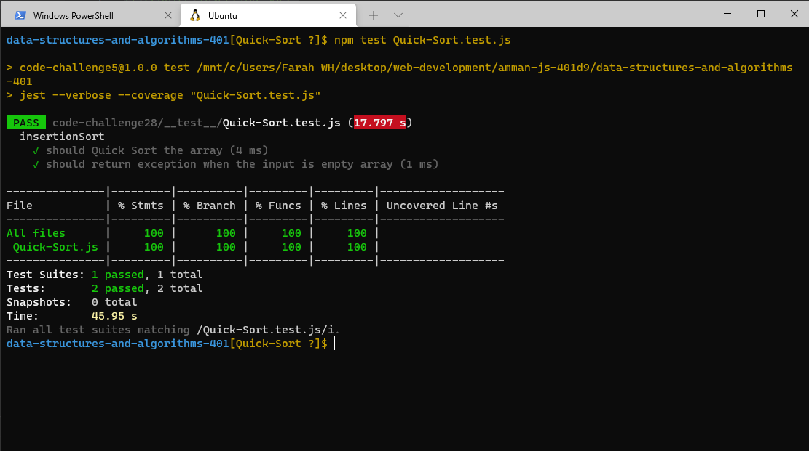

## **CODE CHALLENGE 28 : Quick Sort**

Like Merge Sort, QuickSort is a Divide and Conquer algorithm. It picks an element as pivot and partitions the given array around the picked pivot. There are many different versions of quickSort that pick pivot in different ways. 

### **Pseudocode :**

    ALGORITHM QuickSort(arr, left, right)
    if left < right
        // Partition the array by setting the position of the pivot value 
        DEFINE position <-- Partition(arr, left, right)
        // Sort the left
        QuickSort(arr, left, position - 1)
        // Sort the right
        QuickSort(arr, position + 1, right)

    ALGORITHM Partition(arr, left, right)
    // set a pivot value as a point of reference
    DEFINE pivot <-- arr[right]
    // create a variable to track the largest index of numbers lower than the defined pivot
    DEFINE low <-- left - 1
    for i <- left to right do
        if arr[i] <= pivot
            low++
            Swap(arr, i, low)

     // place the value of the pivot location in the middle.
     // all numbers smaller than the pivot are on the left, larger on the right. 
     Swap(arr, right, low + 1)
    // return the pivot index point
     return low + 1

    ALGORITHM Swap(arr, i, low)
    DEFINE temp;
    temp <-- arr[i]
    arr[i] <-- arr[low]
    arr[low] <-- temp

[Quick-Sort Code](https://github.com/farahalwahaibi/data-structures-and-algorithms-401/blob/main/code-challenge28/Quick-Sort.js)

[Quick-Sort Test](https://github.com/farahalwahaibi/data-structures-and-algorithms-401/blob/main/code-challenge28/__test__/Quick-Sort.test.js)

### **White Board for Insertion Sort**

### **BLOG**
[BLOG file](https://github.com/farahalwahaibi/data-structures-and-algorithms-401/blob/main/code-challenge28/BLOG.md)

### **Test**

[Quick-Sort Test](https://github.com/farahalwahaibi/data-structures-and-algorithms-401/blob/main/code-challenge28/__test__/Quick-Sort.test.js)

