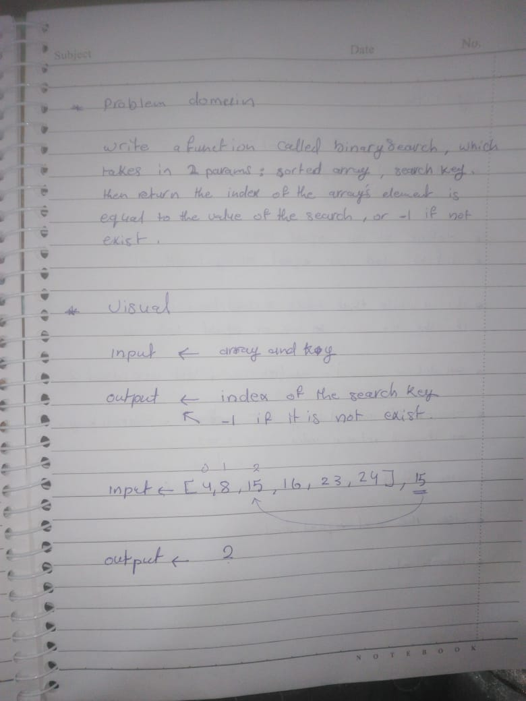
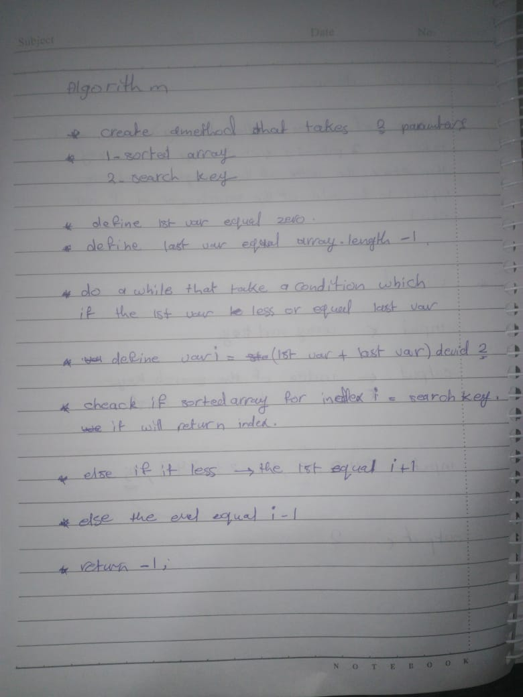
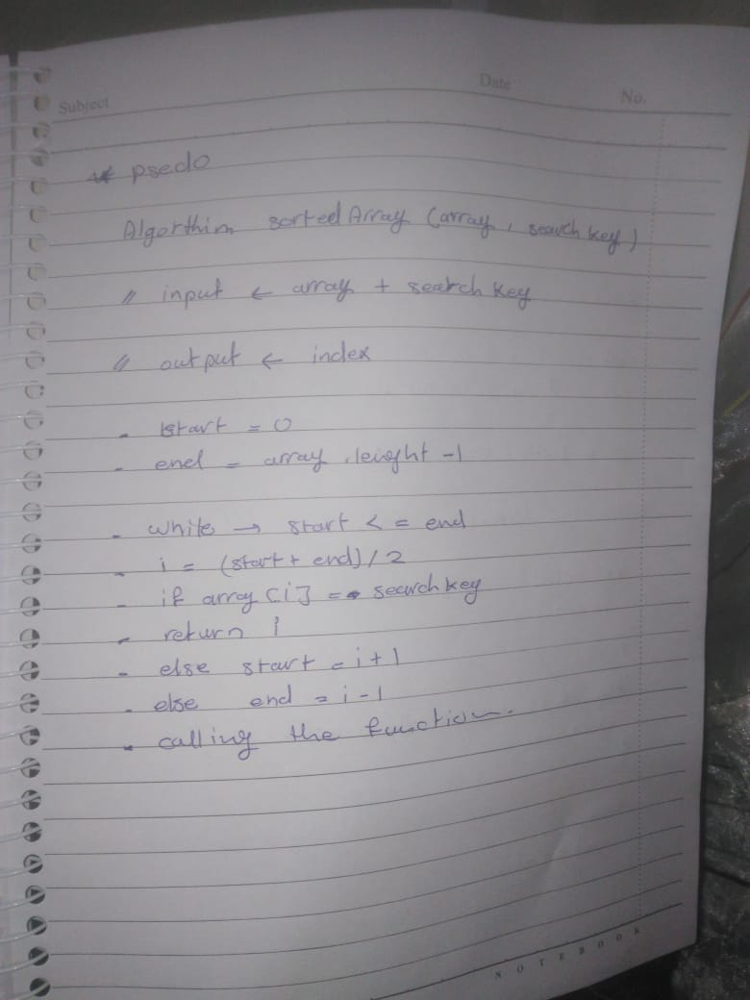
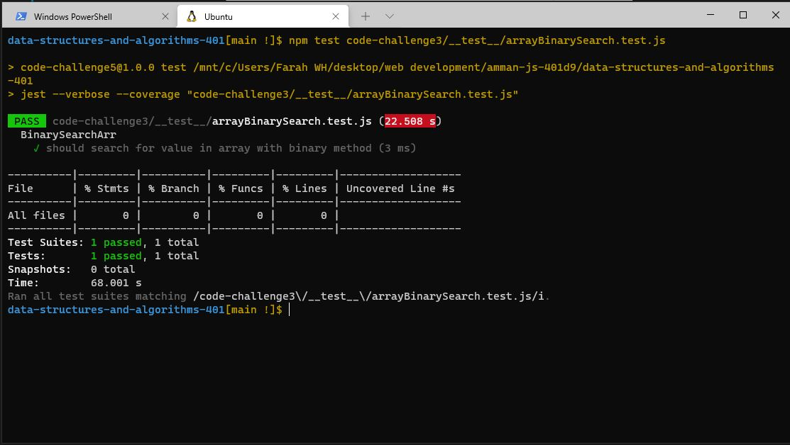

## CODE CHALLENGE THREE : Array Binary Search

[Array Binary Search CODE](https://replit.com/@FarahWahaibi/Array-Binary-Search#script.js)

[Array Binary Search Test CODE](https://replit.com/@FarahWahaibi/Array-Binary-Search#script.js)

#### **Big(O)TIME = O(log(n))**
#### **Big(O)SPACE = O(log(n))**

***

#### **Edge Cases :**
* Input string instead of array
* Input number instead of array
* Input empty array
* Input string instead of searchKey
* Input array instead of searchKey

***

