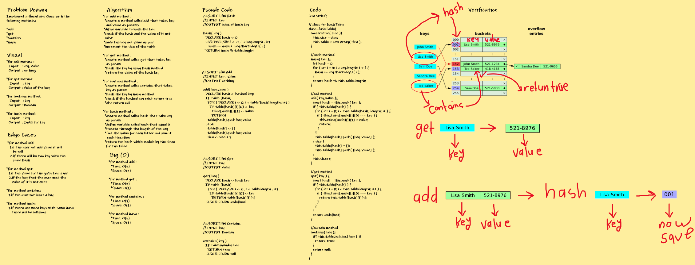

## **CODE CHALLENGE 30 : Hash Table**

A hash table (often called a hash map) is a data structure that maps keys to values. Hash tables combine lookup, insert, and delete operations in an efficient way. The key is sent to a hash function that performs arithmetic operations on it. The result (called the hash value or hash) is an index of the key-value pair.

### **Implement a Hashtable Class with the following methods:**

**add**
* Arguments: key, value
* Returns: nothing
* This method should hash the key, and add the key and value pair to the table, handling collisions as needed.

**get**
* Arguments: key
* Returns: Value associated with that key in the table

**contains**
* Arguments: key
* Returns: Boolean, indicating if the key exists in the table already.

**hash**
* Arguments: key
* Returns: Index in the collection for that key

[Hash Table Code](https://github.com/farahalwahaibi/data-structures-and-algorithms-401/blob/main/code-challenge30/hashtable.js)

[Hash Table Test](https://github.com/farahalwahaibi/data-structures-and-algorithms-401/blob/main/code-challenge30/__test__/hashtable.test.js)

### **White Board for Insertion Sort**

### **Test**

[Hash Table Test](https://github.com/farahalwahaibi/data-structures-and-algorithms-401/blob/main/code-challenge30/__test__/hashtable.test.js)

