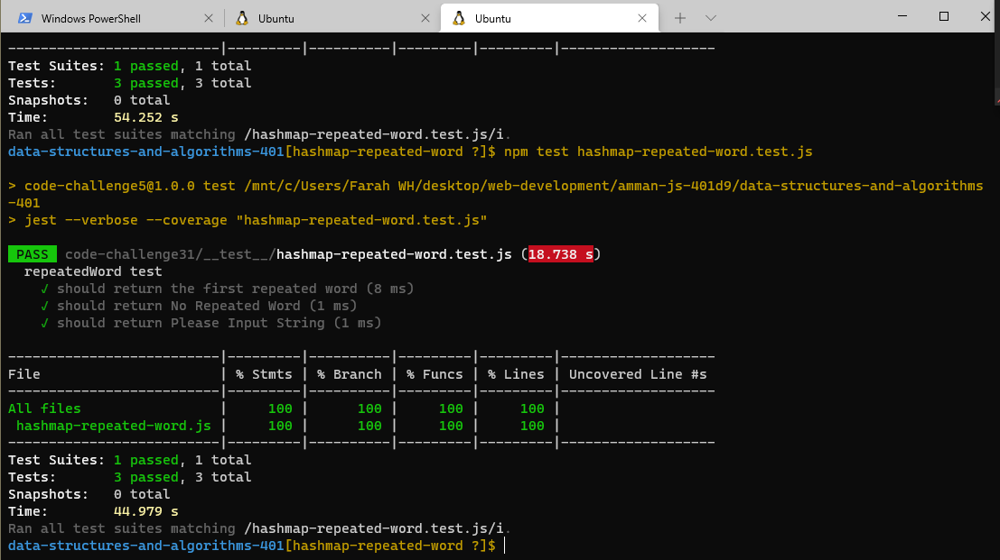

## **CODE CHALLENGE 31 : Hash Map Repeated Word**

Write a function called repeated word that finds the first word to occur more than once in a string
* Arguments: string
* Return: string

[Hash Map Repeated Word Code](https://github.com/farahalwahaibi/data-structures-and-algorithms-401/blob/main/code-challenge31/hashmap-repeated-word.js)

[Hash Map Repeated Word Test](https://github.com/farahalwahaibi/data-structures-and-algorithms-401/blob/main/code-challenge31/__test__/hashmap-repeated-word.test.js)

### **White Board for Hash Map Repeated Word**

### **Test**

[Hash Map Repeated Word Test](https://github.com/farahalwahaibi/data-structures-and-algorithms-401/blob/main/code-challenge31/__test__/hashmap-repeated-word.test.js)

