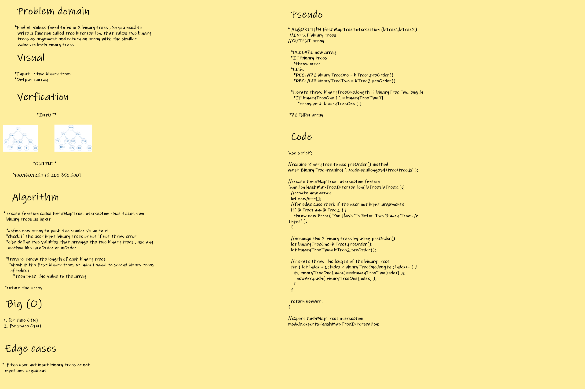
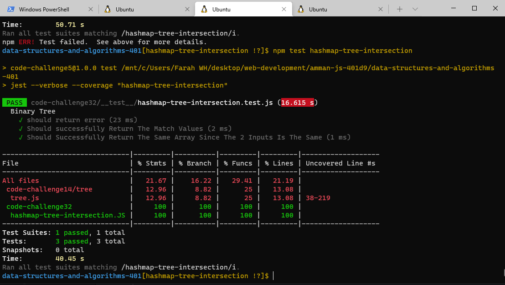

## **CODE CHALLENGE 32 : Hash Map Tree Intersection**

**Find all values found to be in 2 binary trees**

* Write a function called tree intersection
  * Arguments: two binary trees
  * Return: array

[Hash Map Tree Intersection Code](https://github.com/farahalwahaibi/data-structures-and-algorithms-401/blob/main/code-challenge32/hashmap-tree-intersection.js)

[Hash Map Tree Intersection Test](https://github.com/farahalwahaibi/data-structures-and-algorithms-401/blob/main/code-challenge32/__test__/hashmap-tree-intersection.test.js)

### **White Board for Hash Map Tree Intersection**

### **Test**

[Hash Map Tree Intersection Test](https://github.com/farahalwahaibi/data-structures-and-algorithms-401/blob/main/code-challenge32/__test__/hashmap-tree-intersection.test.js)