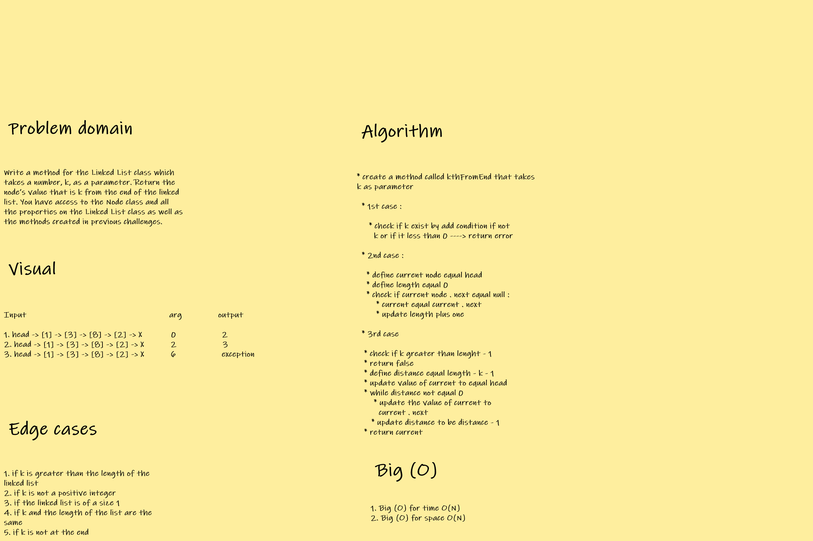

## CODE CHALLENGE FIVE : LINKED LISTS

[LinkedList Class Code](https://github.com/farahalwahaibi/data-structures-and-algorithms-401/blob/main/code-challenge5/LL.js)

[LinkedList Test](https://github.com/farahalwahaibi/data-structures-and-algorithms-401/blob/main/code-challenge5/__test__/LL.test.js)

[Node Class Code](https://github.com/farahalwahaibi/data-structures-and-algorithms-401/blob/main/code-challenge5/node.js)

[Node Test](https://github.com/farahalwahaibi/data-structures-and-algorithms-401/blob/main/code-challenge5/__test__/node.test.js)

### **White Board for linked list : kth-from-end**

